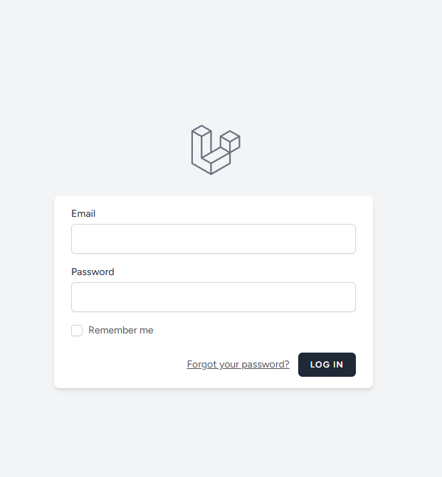
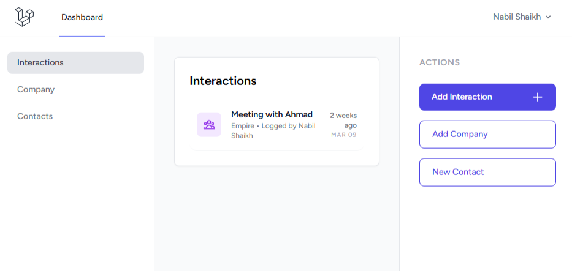
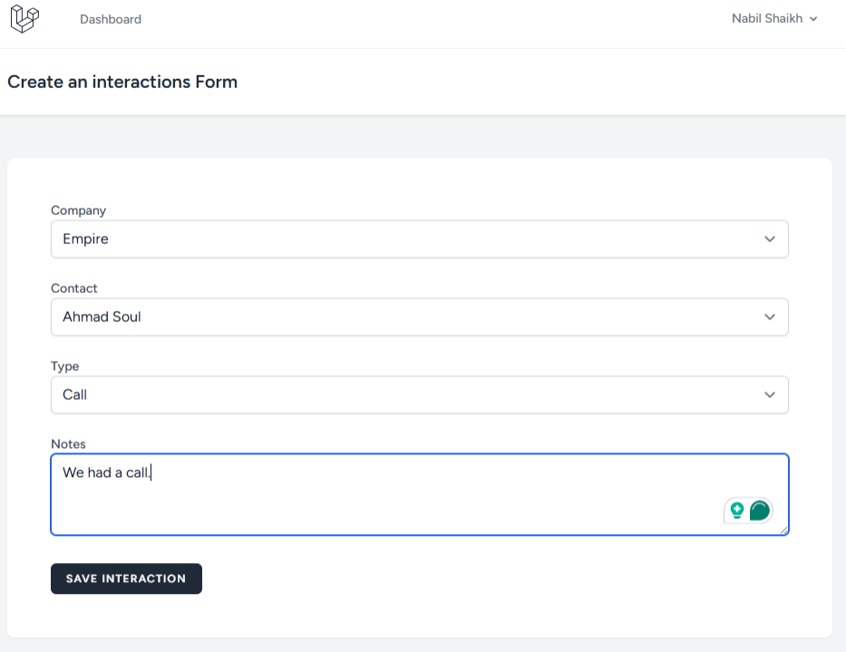
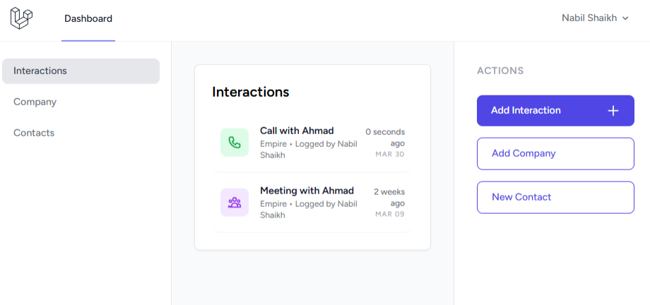

# Mini CRM

A streamlined Customer Relationship Management (CRM) application for managing companies, contacts, and their interactions. Built with a focus on simplicity, speed, and a modern user experience.

## 🚀 Features

- **Company Management**: Keep track of organizations.
- **Contact Management**: Manage people associated with companies.
- **Interaction Tracking**: Record logs of meetings, calls, and emails.
- **Clean Interface**: Responsive design built with Tailwind CSS and Blade components.
- **Modern Stack**: Leverages Laravel 12, Livewire 4, and **Volt** for a smooth, reactive, single-file component architecture.

## 🛠️ Tech Stack

- **Framework**: [Laravel 12](https://laravel.com)
- **Frontend**: [Livewire](https://livewire.laravel.com), [Tailwind CSS](https://tailwindcss.com), [Alpine.js](https://alpinejs.dev)
- **Language**: PHP 8.2+
- **Database**: SQLite (default, easily configurable to MySQL/PostgreSQL)

## 💻 Getting Started

Follow these steps to get the project running locally.

### Prerequisites

Ensure you have the following installed:
- **PHP 8.2+**
- **Composer**
- **Node.js & NPM**
- **SQLite** (or your preferred database)

### Installation & Setup

1. **Clone the repository**
   ```bash
   git clone https://github.com/nabil/mini-crm.git
   cd mini-crm
   ```

2. **Install PHP dependencies**
   ```bash
   composer install
   ```

3. **Install & build frontend assets**
   ```bash
   npm install
   npm run build
   ```

4. **Environment configuration**
   ```bash
   cp .env.example .env
   ```
   *Note: By default, the app uses SQLite. Ensure `DB_CONNECTION=sqlite` is set in your `.env`.*

5. **Generate Application Key**
   ```bash
   php artisan key:generate
   ```

6. **Initialize the database**
   ```bash
   # Creates the database file and runs migrations with seed data
   touch database/database.sqlite
   php artisan migrate --seed
   ```

### Running the Application

1. **Start the local development server**
   ```bash
   php artisan serve
   ```

2. **Start a Vite dev server** (in a separate terminal)
   ```bash
   npn run dev
   ```

3. **Access the website**
   Open your browser and navigate to: `http://127.0.0.1:8000`

   Create an account and explore :)

# Exploration of the site

Just in case it's too difficult to get started I've included some pictures from log in to basic functionality: 

### 1. Secure Authentication
This is the basic login functionality. 


### 2. Dashboard & Data Overview
The Dashboard with some data already collected. To create an interaction a company and contact within that company must first be created.


### 3. Creating a new interaction:
   The interesting thing about this form is that Laravel doesn't quite like the fact that we want a build a contact list dropdown that's dependant on the Company. We have to use a javascript library called **Livewire (Volt)** that will help us to call a list of contacts based on the company we selected - creating a reactive user experience within Laravel. Selecting a company triggers a server-side update to filter the contact list. Otherwise we would have to call all contacts and filter contacts on a company once a company has been selected, which is not performant. 


```PHP
<?php

// resources/views/components/create-interaction.blade.php
use Livewire\Component;
use App\Models\Company;
use App\Models\Contact;
use App\Models\Interaction;

// Very interesting component, uses Livewire to create a dynamic form for creating interactions.
// When a company is selected, it fetches the related contacts and updates the contact dropdown.
new class extends Component {
    public $companies;
    public $contacts = [];
    public $selectedCompany = null;
    public $selectedContact = null;
    public $type = 'call';
    public $notes;

    public function mount()
    {
        $this->companies = Company::all();
    }

    public function updatedSelectedCompany($companyId)
    {
        $this->contacts = Contact::where('company_id', $companyId)->get();
        $this->selectedContact = null;
    }

    public function save()
    {
        $this->validate([
            'selectedCompany' => 'required',
            'selectedContact' => 'required',
            'type' => 'required',
            'notes' => 'nullable|min:5',
        ]);

        Interaction::create([
            'user_id' => auth()->id(),
            'company_id' => $this->selectedCompany,
            'contact_id' => $this->selectedContact,
            'type' => $this->type,
            'notes' => $this->notes,
        ]);

        return redirect()->route('dashboard', ['tab' => 'interactions']);
    }
}; 

// Blade template here. Please see file for details.

?>
```

### 4. Final dashboard with new interaction
